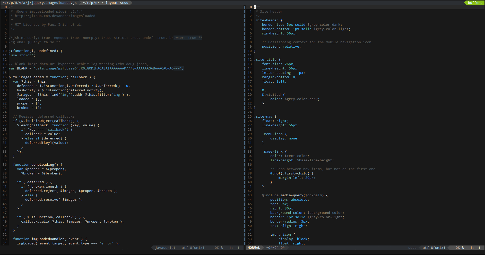
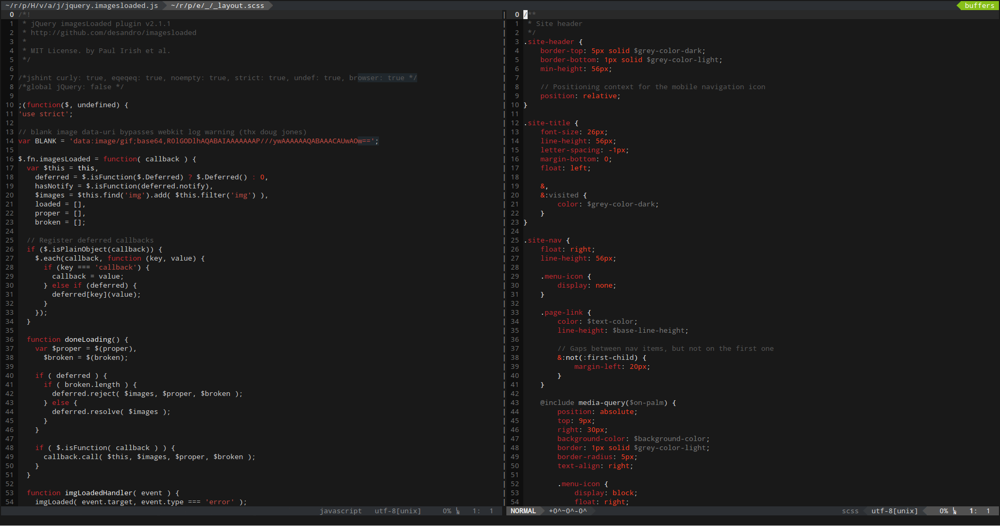
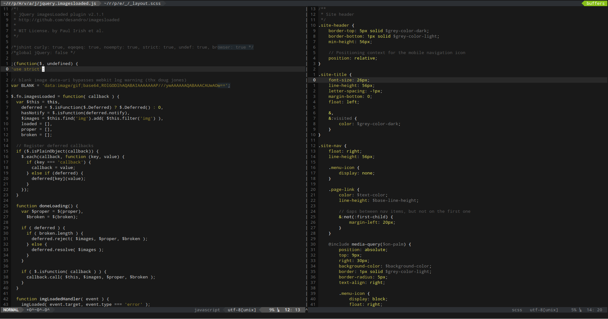

# Phoenix Color Scheme for Vim

Monochrome Vim color scheme based on [Phoenix](https://github.com/netatoo/phoenix-theme).

## A Couple of Notes

- Might be slightly different from the original
- Terminal colors are much different and simplified
- Not entirely monochrome for improved usability (e.g. errors are red, diffs are green, yellow and red)
- Available colors: Blue (default), Red, Green, Yellow, Orange, Purple (not pink)
- Pull requests welcome

## Installation

### Manual

1.  Copy `phoenix.vim` into your `.vim/colors` directory.

### Pathogen

1.  Install [Pathogen](https://github.com/tpope/vim-pathogen)
2.  Copy `vim-phoenix` directory into your `.vim/bundle` directory.

### Modify .vimrc

Set the colorscheme in your .vimrc, this will set Phoenix Blue by default

    colorscheme phoenix

To set other colors (available colors: Blue, Red, Green, Yellow, Orange, Purple)

    colorscheme phoenix
    PhoenixRed

To set eighties background

    colorscheme phoenix
    PhoenixBlueEighties

## Screenshots

## License

Based on [Phoenix](https://github.com/netatoo/phoenix-theme) by [@netatoo](https://github.com/netatoo)
